# DeepSeek 用量小鲸鱼桌宠（DeepSeek Usage Pet）


一只透明的桌面小鲸鱼，随时显示你的 DeepSeek **余额**与**今日消耗**，并内置**用量统计面板**（日级/分时图表、历史回填、充值余额、上次同步时间）。

基于 [momo-OwO-qwq/DeepSeek-Whale-Pet](https://github.com/momo-OwO-qwq/DeepSeek-Whale-Pet)（MIT）二次开发的独立改版项目，已与原项目分离。其中**用量统计功能**参照 [33March7/deepseek-api-usage-statistics](https://github.com/33March7/deepseek-api-usage-statistics)（Unlicense）实现。

## 架构概览

整体是一个 Electron 桌面应用，采用「**主进程（Node.js 特权）** + **渲染进程沙箱**（contextIsolation）」的双层结构，二者通过 `preload.js` 的 contextBridge（`window.whaleAPI`）安全通信。核心运行时包括：主进程 `main.js`（窗口 / 托盘 / IPC / 登录 / 同步）、官方余额 API 的 `BalanceService`、平台私有接口的 `UsageSync`、本地 **sql.js SQLite** 存储，以及桌宠 / 设置 / 用量统计三个渲染窗口。托盘、记账「对账取大」、启动自动同步、config 0600 等支持性细节放在底部卡片，未额外堆连线。外部依赖为 `api.deepseek.com`（余额）与 `platform.deepseek.com`（用量 / 令牌）。


> 上图由 [Archify] 基于仓库真实代码生成。

## 界面预览

用量统计面板（`renderer/usage.*`）是「对账 + 用量可视化」的核心入口。以下截图展示了它在 Windows 上的实际效果（配色为 Tableau 10 风格调色板）。

用量统计需要**平台令牌**：点面板右上角「登录平台获取令牌」在弹出窗口登录后自动抓取，或点「手动粘贴令牌」在弹窗中粘贴 `userToken` 兜底。

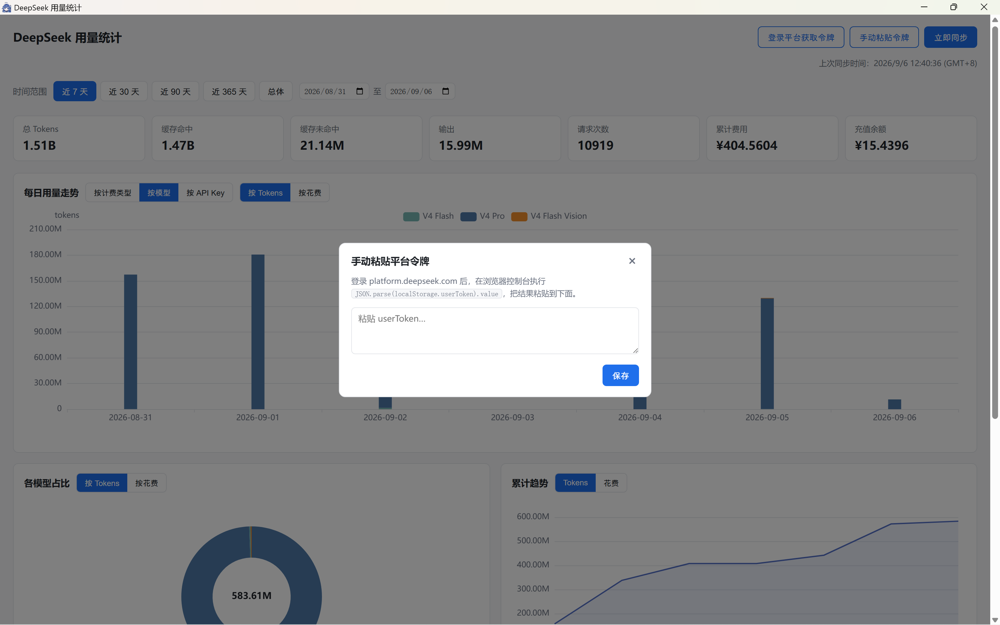

顶部卡片实时显示总 Tokens、**输入缓存命中率**、缓存命中、缓存未命中、输出、请求次数、累计费用与充值余额；**每日用量走势**支持按模型 / 按计费类型 / 按 API Key 拆分，并可在 **Tokens / 费用 / 缓存命中率** 三种指标间切换。

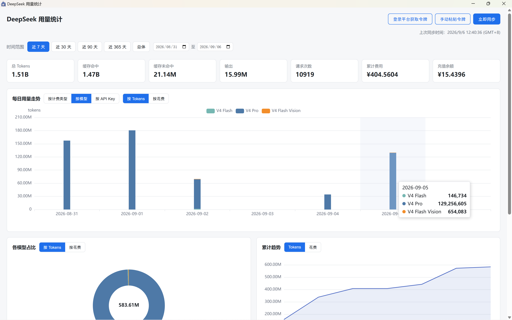

点击每日走势的柱子可下钻当天的 **24 小时分时明细**：按模型拆分的柱状图 + 费用折线，悬停查看每个小时的 Tokens / 费用，并可继续按计费类型 / API Key 拆分。

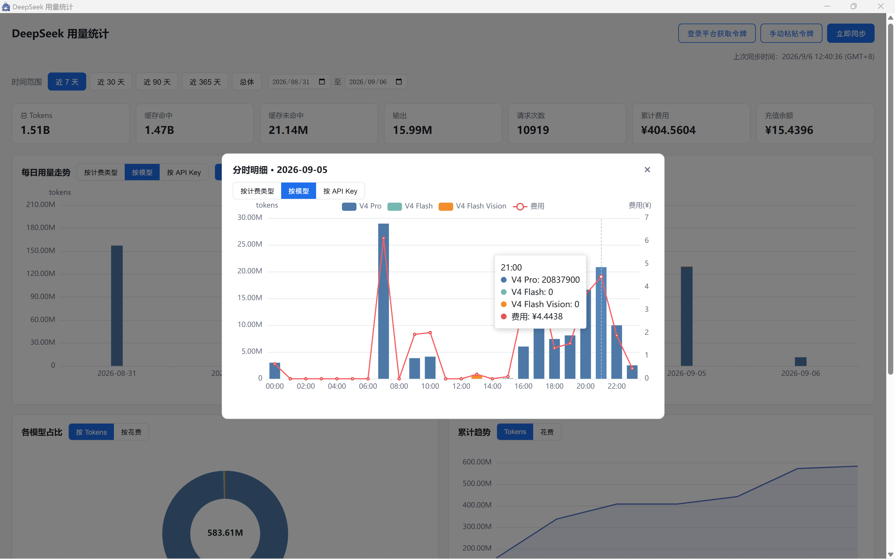

模型名称会以易读别名显示：`deepseek-v4-flash` 与 `deepseek-flash` 合并为 **V4 Flash**；**V4 Flash Vision**、**V4.1 Flash** 和 **V4 Pro** 仍分别统计。合并只作用于图表与报表，数据库继续保留平台返回的原始模型 ID。

**各模型占比**环形图、**累计趋势**与**用量热力图**一屏尽览，均跟随当前日期范围并可在 Tokens / 费用间切换；热力图按「周 × 天」网格展示历史用量，悬停即可查看某天的具体数字。

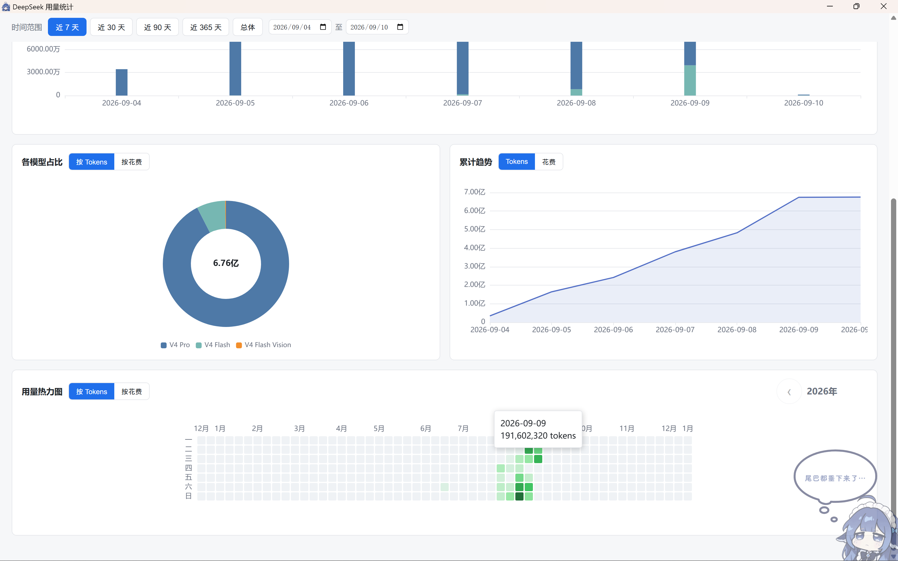

设置窗口按功能分为账户、数据、外观、文案、音效、图片和表情等页面。下面的截图按设置窗口标签顺序排列：账户与平台令牌、用量与同步、外观、文案、音效、图片和表情。表情页可独立启用各类状态并调整触发时长；文案页支持自定义余额提示、预警提示、随机台词及台词间隔，方便按自己的使用习惯调整桌宠反馈。

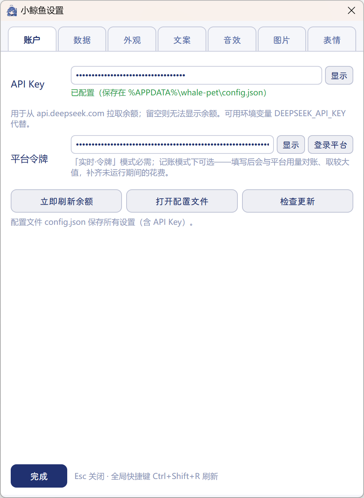

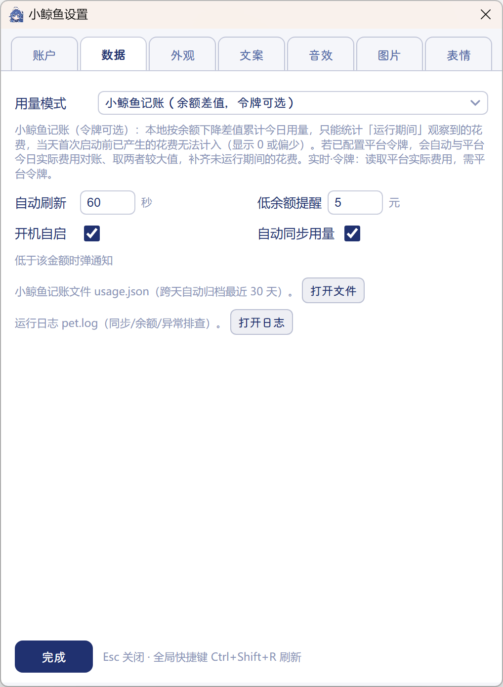

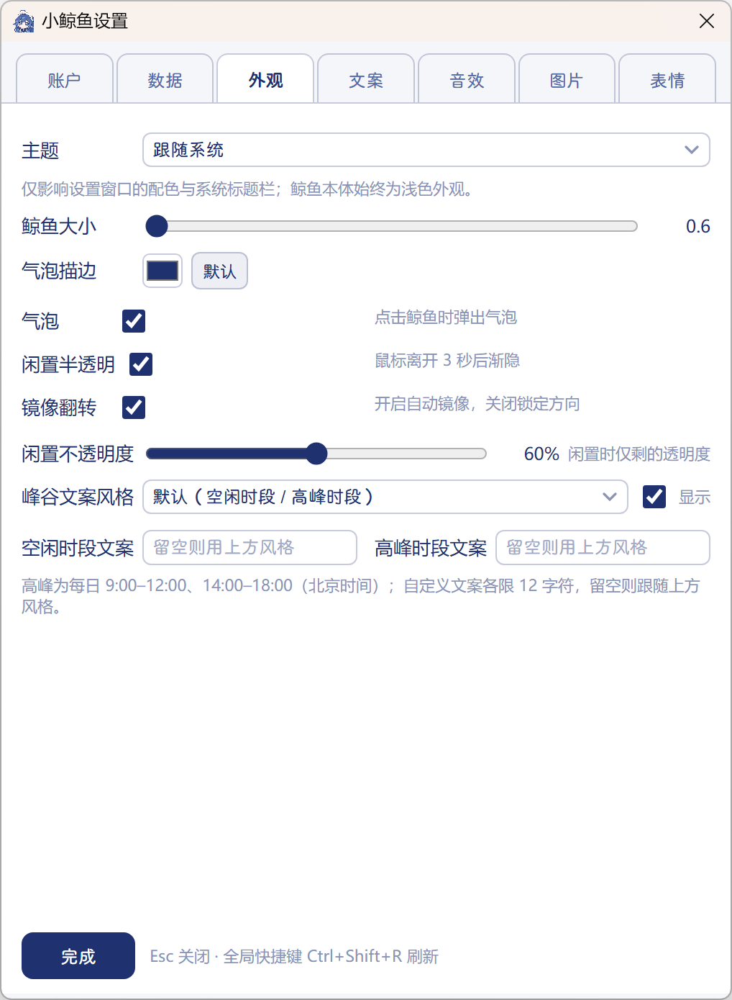

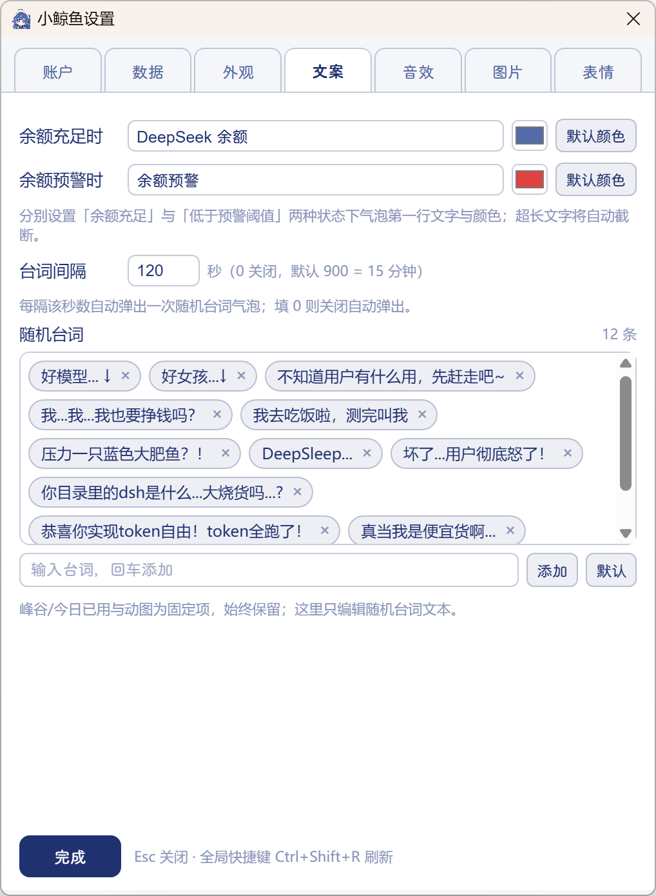

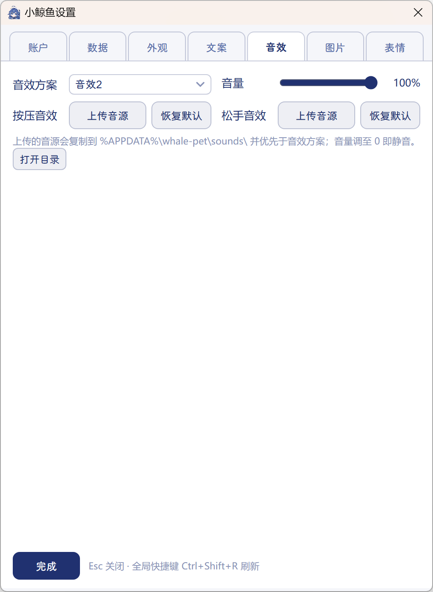

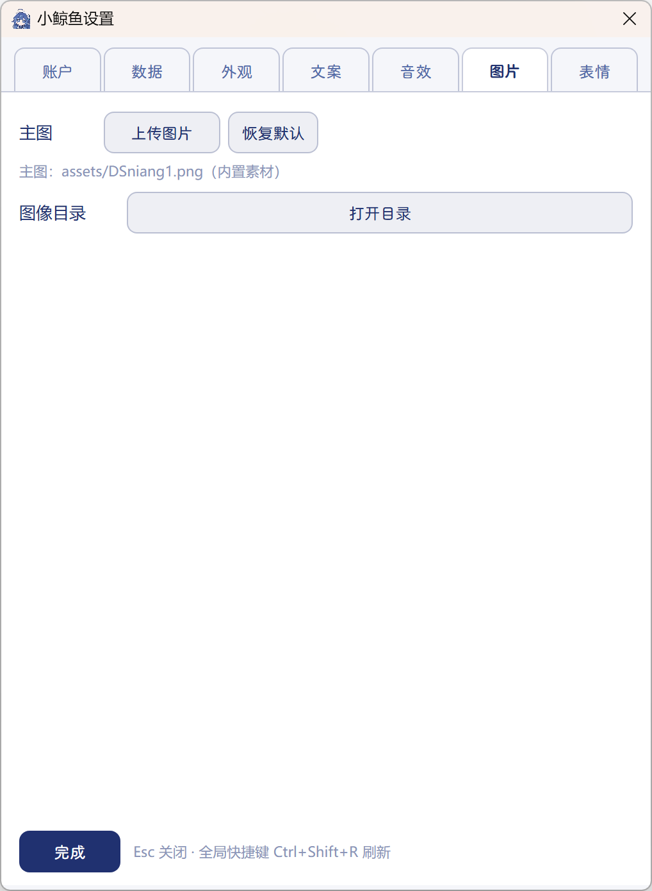

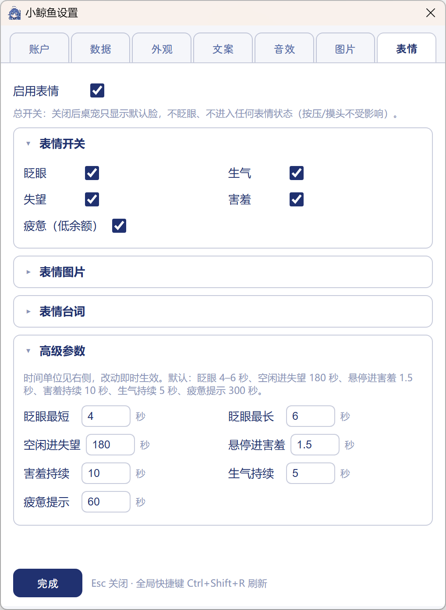


## 特性

### 桌宠

- 🐋 透明置顶、无边框、无任务栏条目的浮动窗口，始终置顶
- 🖱️ 自由拖拽、方向感知镜像（设置可开关：开启时拖到左半屏贴左缘并左右镜像、右半屏贴右缘恢复原方向；关闭则锁定当前方向；重启恢复默认贴右）
- 🐋 点击穿透：窗口用 `setShape` 裁剪为鲸鱼/气泡/按钮区域，透明区点击直接落到桌面
- 🧸 按压 Q 弹 + 音效、呼吸动画、闲置半透明
- 💰 余额气泡：60 秒自动刷新、余额变化数字滚动、点击手动刷新、低余额系统通知
- 💬 随机台词 + 峰谷提示：点击鲸鱼弹余额，点气泡默认显示峰谷状态（随机台词已降频）
- 🎭 表情状态机：眨眼 / 生气（连点）/ 失望（空闲）/ 害羞（悬停）/ 疲惫（低余额换图 + 每 5 分钟提示），表情图与台词均可自定义

### 托盘

- 「显示鲸鱼」带勾选状态（实时反映可见性）
- 「鼠标穿透」带勾选状态：整窗不接收鼠标事件并自动半透明，方便查看/操作桌面下方内容
- 立即刷新 / 打开设置 / 用量统计 / 开机自启 / 退出

### 设置

- API Key、平台令牌（**自动登录提取** + 手动粘贴兜底）
- 外观 / 文案 / 音效 / 图片 / 随机台词 / 主题 / **镜像翻转开关**
- 表情：行为开关 / 表情图上传 / 台词编辑 / 触发与持续时间参数
- 运行日志：`pet.log`（1MB 轮转），设置「数据」页可一键「打开日志」

### 用量统计（新增）

- 历史日级回填：用平台令牌从官网尽量回溯全部历史用量（30 天一段，遇连续空段停止）
- 每日用量走势：按模型 / 按计费类型 / 按 API Key 三种拆分，并支持 **Tokens / 费用 / 缓存命中率** 三种指标切换；点击图表下钻 24 小时分时明细（弹窗）
- 各模型占比（饼图）、累计趋势、用量热力图：均支持 Tokens / 费用切换，并跟随当前日期范围
- 分时数据本地累积：每次同步保存「今昨」分时，日积月累可看更早分时（突破平台「只保留两天」的限制）
- 图表图例可交互：点击图例项（如「缓存命中 / 缓存未命中 / 输出 / 费用」）可**隐藏该项**，只看其余数据，再次点击恢复
- 范围选择：近 7 / 30 / 90 / 365 天 + 自定义日期
- 顶部卡片：总 tokens / **输入缓存命中率** / 缓存命中 / 未命中 / 输出 / 请求次数 / 累计费用 / **充值余额**
- 启动自动同步：配置令牌后，启动及运行期间自动补同步（每小时检查、超 12h 轻量同步），可在设置关闭
- 同步进度与取消：历史回填会显示进度（「回填到 YYYY-MM-DD」），可中途取消
- 显示**上次同步时间**（GMT+8）

## 快速开始

> 需要 Node.js（含 npm），建议 Node 18 及以上（Electron 39 构建要求）。

```bash
cd DeepseekAPIUsagePet
npm install
npm start
```

首次使用：

1. 右键鲸鱼 → 设置 → 填入 **API Key**（`sk-` 开头）即可显示余额。
2. 用量统计需要**平台令牌**：托盘 → 用量统计 → 点「登录平台获取令牌」，在弹出窗口中登录 DeepSeek 平台后自动抓取；也可以手动粘贴。
3. 点「立即同步」拉取历史用量。

## 使用

| 操作 | 效果 |
|---|---|
| 单击鲸鱼 | 弹出余额气泡并刷新 |
| 按住拖动 | 移动鲸鱼 |
| 点击气泡 | 显示峰谷状态（80% 概率）；小概率切随机台词；再点关闭 |
| 右键鲸鱼 / 悬停右上角汉堡按钮 | 打开设置 |
| 托盘「用量统计」 | 打开用量面板 |
| `Ctrl+Shift+R` | 全局刷新余额 |

## 配置与数据

所有数据保存在 `%APPDATA%/whale-pet/`（Windows；Linux/macOS 路径见 `lib/config.js`，可用环境变量 `WHALE_PET_HOME` 重定向）：

```text
whale-pet/
├── config.json    # 全部设置（含 API Key / platformToken）
├── usage.db       # sql.js SQLite：日级/分时用量、余额快照、上次同步时间
├── usage.json     # 记账账本（余额差值累计今日用量，跨天归档 30 天）
├── lines.json     # 随机台词池（首次自动生成）
├── pet.log        # 运行日志（1MB 轮转，旧日志 pet.log.1）
└── raw/           # 平台接口原始响应存档（上限 100 份）
```

## 目录结构

```text
DeepseekAPIUsagePet/
├── AGENTS.md / DESIGN.md / README.md   # 项目说明 / 设计文档 / 本文件
├── main.js / preload.js                # Electron 主进程 / IPC 安全桥
├── lib/
│   ├── balance.js     # 官方余额 API + 平台实际费用 + BalanceService
│   ├── config.js      # 配置读写（消毒 + 原子写 + 环境变量覆盖）
│   ├── ledger.js      # 小鲸鱼记账（余额差值）
│   ├── lines.js       # 随机台词池
│   ├── log.js         # 文件日志（pet.log 轮转 + 终端回显 + 密钥掩码）
│   ├── store.js       # sql.js 存储层（schema + upsert + 查询）
│   └── usage-sync.js  # 平台私有接口 → 用量回填/分时/余额/账号指纹
├── renderer/
│   ├── pet.*          # 鲸鱼桌宠窗口
│   ├── menu.*         # 设置窗口
│   ├── usage.*        # 用量统计面板（ECharts）
│   └── echarts.min.js # 图表库
├── assets/            # 鲸鱼素材 / 音效
└── test/              # 单元测试
```

## 打包与分发

支持两种 Windows 产物，`npm run dist:win` 一次生成（会自动整理到 installer / portable 目录并生成便携版 zip）：

| 产物 | 位置 | 说明 |
|---|---|---|
| 安装包 | `dist/installer/` | NSIS 向导式安装：可选安装目录、可选「仅当前用户 / 所有用户」、中文界面、自动创建桌面与开始菜单快捷方式 |
| 便携版 | `dist/portable/` | 免安装：单文件 exe + zip（解压即用） |

Linux 的 **AppImage** 由 GitHub Actions 在发布 tag 时自动构建，并挂到对应 Release（见 `.github/workflows/build-linux.yml`）。也可在 Linux 上手动执行 `npm run dist:linux` 构建。

> 联网下载 Electron / NSIS 工具链时建议走 npmmirror 镜像，避免直连 GitHub 失败：
>
> ```powershell
> $env:ELECTRON_MIRROR="https://npmmirror.com/mirrors/electron/"
> $env:ELECTRON_BUILDER_BINARIES_MIRROR="https://npmmirror.com/mirrors/electron-builder-binaries/"
> npm run dist:win
> ```

> 安装包未做代码签名：首次双击时 Windows SmartScreen 会提示「未知发布者」，点「更多信息 → 仍要运行」即可。

> 打包使用 electron-builder 26；其部分二进制 npmmirror 镜像可能缺失，首次在本机打包需从 GitHub 手动补下载（见 [AGENTS.md](AGENTS.md)）。

## 开发

```bash
npm test         # 单元测试（node --test）
npm run smoke    # 自动化冒烟测试（窗口/托盘/点击/拖拽截图验证）
npm run dist:win # 打包（安装包 + 便携版）
npm run dist:linux # 打包 Linux 产物（AppImage/deb/rpm/tar.gz，需在 Linux 上执行）
```

更多架构细节、踩坑记录见 [AGENTS.md](AGENTS.md) 与 [DESIGN.md](DESIGN.md)。

## 说明

- **「每轮对话花费」已移除**：DeepSeek 官网明示「数据可能有 5 分钟延迟」，余额差值无法精确到单轮。
- 平台**分时数据只保留今天 + 昨天**，但本程序会本地累积保存，同步过的更早日期仍可看分时。
- 存储用 **sql.js（WASM）** 而非 better-sqlite3（原生模块有 NAPI 兼容问题）。
- 运行环境 **Electron 39**（已从 34 升级，修复运行时 CVE）。
- 已**禁用硬件加速**以降低内存占用（约省 260MB）。
- **鼠标穿透在 Linux Wayland / XWayland 下不可用**：`setIgnoreMouseEvents` 与 `setShape` 在这些环境下不可靠，请在系统登录会话改用 **X11**（或在桌面环境设置里关闭 Wayland）后再使用穿透功能。

## 与父项目 / 原版的差异

| 维度 | 父项目（DSH Web 插件） | 原版（momo 桌宠） | 本项目（改版） |
|---|---|---|---|
| 运行环境 | DSH Web 界面（注入页面） | 独立 Electron 桌面应用 | 独立 Electron 桌面应用 |
| 余额 | 官方 `/user/balance` | 官方 `/user/balance` | 官方 `/user/balance` |
| 今日已用 | 双模式（记账 / 令牌） | 双模式（记账 / 令牌） | 双模式 + **记账对账取大** |
| 每轮对话花费 | 监听 DSH 会话事件 | 不适用（独立应用） | **已移除**（余额 5 分钟延迟无法精确） |
| 用量统计 | 无 | 无 | **新增**（历史回填 / 日级·分时图表 / 充值余额 / 同步时间） |
| 平台令牌登录 | DSH 凭据服务 | 手动粘贴 | **登录窗自动提取** + 手动粘贴兜底 |
| 系统集成 | 无（依托 DSH） | 托盘 + 全局热键 + 通知 + 单实例 | 同左 + **显示/隐藏勾选** + **用量统计入口** |
| 点击穿透 | 页面透明区穿透 | `setShape` 窗口裁剪 | `setShape`（**修复 width/height 参数**）+ 命中区贴合轮廓 |
| 存储 | `$DSH_HOME/*.json` | `config.json` + `usage.json` | `config.json` + **sql.js SQLite**（`usage.db`） |
| 图表 | 无 | 无 | **ECharts** |
| 内存优化 | — | — | **禁用硬件加速** + 设置窗口按需创建 |

## 更新日志

详细版本历史见 [CHANGELOG.md](CHANGELOG.md)。安全漏洞报告见 [SECURITY.md](SECURITY.md)。

## 许可证

MIT License，见 [LICENSE](LICENSE)。鲸鱼素材与音效沿用原项目；桌宠表情图（`assets/expressions/` 下的按压/生气/失望/害羞/疲惫/眨眼帧）取自父项目 [MeteorNOX/DeepSeek-Balance-Whale-Widget](https://github.com/MeteorNOX/DeepSeek-Balance-Whale-Widget) 的 `For–WinDesktop` 分支，沿用其 MIT 许可。

## 参考项目

- [MeteorNOX/DeepSeek-Balance-Whale-Widget](https://github.com/MeteorNOX/DeepSeek-Balance-Whale-Widget)（MIT）：DSH Web 插件，鲸鱼余额挂件的原始来源（其 `For–WinDesktop` 分支提供了桌宠表情素材与状态机参考）
- [momo-OwO-qwq/DeepSeek-Whale-Pet](https://github.com/momo-OwO-qwq/DeepSeek-Whale-Pet)（MIT）：基于上述挂件实现的独立桌宠版，本项目在此基础上改版
- [33March7/deepseek-api-usage-statistics](https://github.com/33March7/deepseek-api-usage-statistics)（Unlicense）：用量统计的私有接口与存储 schema
